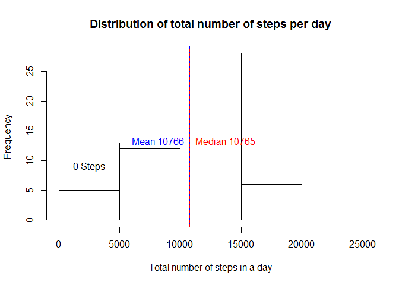
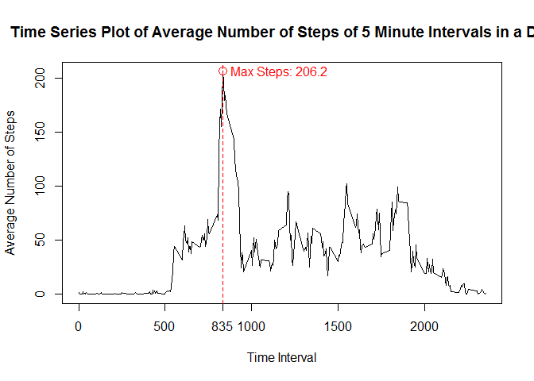
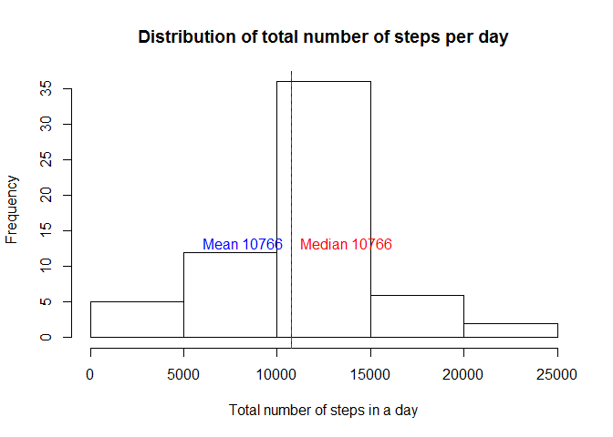
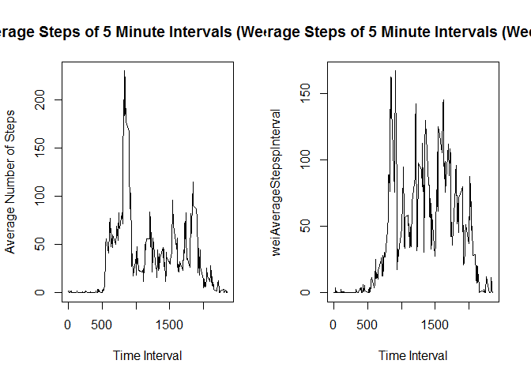

---
title: "Assignment 1"
author: "Philip"
date: "03 October 2016"
output: html_document
---


## Loading and preprocessing the data

This section loads all libraries used in the analysis; 
Then downloads and reads the data for analysis. Additionally, 


```r
library(lubridate)
```

```
## 
## Attaching package: 'lubridate'
```

```
## The following object is masked from 'package:base':
## 
##     date
```


```r
download.file("https://d396qusza40orc.cloudfront.net/repdata%2Fdata%2Factivity.zip"
              ,"activity.zip")
unzip("activity.zip")
```


The appropriate extracts the activity file contained in the GitHub repository downloaded on 2016-10-24.

The data was downloaded and read in as a dataframe. The data field was converted to a date type for further grouping.

```r
activity<-read.csv(file="activity.csv",stringsAsFactors = FALSE)
activity$date<-ymd(activity$date)
summary(activity)
```


## What is the mean total number of steps taken per day?
For the following analysis missing values were ignored. It is additionally assumed
that days with 0 steps is a result of missing data. NAs were removed to prevent
operating on NAs should the sensors report NAs for any particular interval in a day.  

Compute mean of steps over all days by day and then time interval.

```r
AverageStepspDay        <- tapply( 
                             activity$steps
                            ,activity$date
                            ,sum
                            ,na.rm=TRUE)
AverageStepspInterval   <- tapply( 
                             activity$steps
                            ,activity$interval
                            ,mean
                            ,na.rm=TRUE)
```


Mean and Median were determined ignoring days with 0 steps.

```r
StepHist<-hist(AverageStepspDay 
                ,main="Distribution of total number of steps per day"
                ,xlab="Total number of steps in a day")

## Account for 0s induced by likely missing data
AdjustedFrequency <- StepHist$counts[1]-
                        length(x = AverageStepspDay[AverageStepspDay==0])
                        ## Determine Frequency without 0s

segments(StepHist$breaks[1],AdjustedFrequency,
         StepHist$breaks[2],AdjustedFrequency)

text( x = StepHist$mids[1]
     ,y = (AdjustedFrequency+StepHist$counts[1])/2
     ,labels="0 Steps")

meanSteps <- mean  (AverageStepspDay[AverageStepspDay!=0])
medSteps  <- median(AverageStepspDay[AverageStepspDay!=0])

abline( v = c(meanSteps,medSteps)
       ,col = c("blue","red")
       ,lty = c(1,2))
text( x=meanSteps
     ,y = mean(StepHist$counts)+1 #Quick Adjustment on text position
     ,pos = 2
     ,labels = paste("Mean",round(meanSteps,digits = 0))
     ,col = "blue")
text(x=medSteps,y = mean(StepHist$counts)+1 #Quick Adjustment on text position
     ,pos=4
     ,labels = paste("Median",round(medSteps,digits = 0))
     ,col = "red")
```

<!-- -->


## What is the average daily activity pattern?
Timeseries plot of of the 5-minute interval and the average number of steps taken, averaged across all days


```r
plot( x = names(AverageStepspInterval)
     ,type = "l"
     ,y = AverageStepspInterval
     ,xlab = "Time Interval"
     ,ylab = "Average Number of Steps"
     ,main = "Time Series Plot of Average Number of Steps of 5 Minute Intervals in a Day"
     )

# Determine the interval with max steps
MaxStepsInterval <- AverageStepspInterval[
                    AverageStepspInterval==max(AverageStepspInterval)]

# Add tick mark for maximum point
axis(side = 1, at = names(MaxStepsInterval))

symbols( x = names(MaxStepsInterval)
        ,y = MaxStepsInterval
        ,circles = 25
        ,fg="red"
        ,inches = FALSE
        ,add = TRUE
        )
abline( v = names(MaxStepsInterval)
       ,col = "red"
       ,lty = 2)
# Get axis to show interval relevant to me
text( x = names(MaxStepsInterval)
     ,y = MaxStepsInterval 
     ,labels = paste0("Max Steps: ",round(MaxStepsInterval,1))
     ,pos = 4
     ,col = "red"
)
```

<!-- -->


## Inputing missing values

We can see from the following how many missing values we have in the data set.


```r
sum(is.na(activity$steps))
```

```
## [1] 2304
```

My strategy for filling in missing values is to take the average number of steps at the time interval.


```r
I1<-merge( x = activity[is.na(activity$steps),]
      ,y = cbind.data.frame(data.frame(AverageStepspInterval),as.numeric(names(AverageStepspInterval)))
      ,by.x = 'interval'
      ,by.y = 'as.numeric(names(AverageStepspInterval))')
I1<-cbind.data.frame(unname(I1$AverageStepspInterval),I1$date,I1$interval)
names(I1)<-names(activity)
iactivity<-rbind(activity[!is.na(activity$steps),],I1)

# Recount Average Steps
iAverageStepspDay        <- tapply( 
                             iactivity$steps
                            ,iactivity$date
                            ,sum
                            ,na.rm=TRUE)
iAverageStepspInterval   <- tapply( 
                             activity$steps
                            ,activity$interval
                            ,mean
                            ,na.rm=TRUE)
iStepHist<-hist(iAverageStepspDay 
                ,main="Distribution of total number of steps per day"
                ,xlab="Total number of steps in a day")

imeanSteps <- mean  (iAverageStepspDay)
imedSteps  <- median(iAverageStepspDay)

abline( v = c(imeanSteps,imedSteps)
       ,col = c("blue","red")
       ,lty = c(1,2))
text( x=imeanSteps
     ,y = mean(iStepHist$counts)+1 #Quick Adjustment on text position
     ,pos = 2
     ,labels = paste("Mean",round(imeanSteps,digits = 0))
     ,col = "blue")

text(x=imedSteps,y = mean(iStepHist$counts)+1 #Quick Adjustment on text position
     ,pos=4
     ,labels = paste("Median",round(imedSteps,digits = 0))
     ,col = "red")
```

<!-- -->

As we can see from the above, the distribution does not change significantly from
when missing values were ignored; This includes the median and mean with a minor
change in the median to 10766 from 10765.


## Are there differences in activity patterns between weekdays and weekends?


```r
iactivity$Weekday <- wday(iactivity$date)
iactivitywd<-iactivity[iactivity$Weekday>1 & iactivity$Weekday<7,]
iactivitywe<-iactivity[iactivity$Weekday==1 | iactivity$Weekday==7,]

wdiAverageStepspInterval   <- tapply( 
                             iactivitywd$steps
                            ,iactivitywd$interval
                            ,mean
                            ,na.rm=TRUE)
weiAverageStepspInterval   <- tapply( 
                             iactivitywe$steps
                            ,iactivitywe$interval
                            ,mean
                            ,na.rm=TRUE)

par(mfrow=c(1,2))

plot( x = names(wdiAverageStepspInterval)
     ,type = "l"
     ,y = wdiAverageStepspInterval
     ,xlab = "Time Interval"
     ,ylab = "Average Number of Steps"
     ,main = "Average Steps of 5 Minute Intervals (Weekdays)"
     )
plot( x = names(weiAverageStepspInterval)
     ,type = "l"
     ,y = weiAverageStepspInterval
     ,xlab = "Time Interval"
     #,ylab = "Average Number of Steps"
     ,main = "Average Steps of 5 Minute Intervals (Weekends)"
     )
```

<!-- -->
